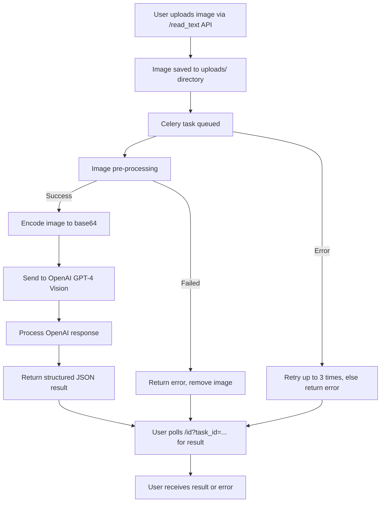

# KYC-OCR

## Technical Overview

KYC-OCR is an asynchronous API service for extracting structured data from images (such as KYC documents) using the GPT-4 Vision model. The system is built with FastAPI for the web API, Celery for background task processing, and Redis as the message broker and result backend. The pipeline ensures robust, scalable, and non-blocking processing of potentially slow OCR and AI tasks.

## Technical Deep Dive for Developers

KYC-OCR is an asynchronous, API-driven service for extracting structured data from KYC document images using OpenAI's GPT-4 Vision model. The system leverages FastAPI for HTTP endpoints, Celery for distributed task processing, and Redis as both the message broker and result backend.

### Key Components
- **FastAPI**: Exposes REST endpoints for image submission and result polling.
- **Celery**: Handles long-running image processing tasks asynchronously.
- **Redis**: Acts as both the Celery broker and result backend.
- **OpenAI GPT-4 Vision**: Performs the actual OCR and data extraction.

---

### Execution Flow

1. **Image Submission**
   - The client POSTs an image to `/read_text` with an API key.
   - The image is saved to disk (`uploads/`), and a Celery task is enqueued with a unique task ID.
   - The API immediately returns the task ID (HTTP 202).

2. **Celery Task: `process_image_task`**
   - **Pre-processing** (`blur_check.image_preops`):
     - Checks for blurriness, glare, and darkness.
     - Attempts to detect and deskew the document.
     - Encodes the result as JPEG bytes.
     - If any check fails, returns a structured error and deletes the image.
   - **Image Analysis**:
     - Encodes the image as base64.
     - Sends it to OpenAI's GPT-4 Vision model.
     - Parses the JSON response.
     - Stores the result (or error) in Redis under the task ID.
     - Cleans up the image file.
   - **Retries**: The task is retried up to 3 times on failure, with a delay between attempts.

3. **Result Retrieval**
   - The client polls `/id?task_id=...` with the task ID and API key.
   - The API checks the Celery task state:
     - `PENDING`: Still processing (HTTP 202)
     - `SUCCESS`: Returns the result (HTTP 200)
     - `FAILURE` or error: Returns error message (HTTP 400/422/500)

---

### Celery Task Pipeline

- **Task Definition**: `process_image_task` is the main Celery task, defined in `app.py`, with retry and error handling logic.
- **Pre-processing**: Uses OpenCV-based checks for image quality and document detection (`blur_check.py`).
- **Image Analysis**: Handles encoding and OpenAI API calls (`image_processing.py`).
- **Result Storage**: Results and errors are stored in Redis via Celery's backend.
- **API Polling**: The client retrieves results asynchronously via the `/id` endpoint.

---

### System Flow Diagram



---

### Error Handling

- All errors in pre-processing or analysis are returned as structured JSON.
- Celery retries failed tasks up to 3 times.
- Temporary files are always cleaned up.

---

### Asynchronous Design

- The API is non-blocking: image processing is offloaded to Celery workers.
- Clients can submit images and poll for results independently, supporting high concurrency and scalability.

**In summary:**  
KYC-OCR is a robust, asynchronous microservice for KYC document OCR, using Celery to decouple heavy image processing from the API layer, ensuring responsiveness and scalability for production workloads.

---

## Key Files

- `app.py`: FastAPI app, API endpoints, and Celery task definition
- `celery_app.py`: Celery configuration and initialization
- `blur_check.py`: Image quality checks and pre-processing
- `image_processing.py`: Image encoding, OpenAI API call, and response parsing
- `auth.py`: API key authentication

---

## Error Handling & Retries
- Pre-processing and image analysis errors are caught and returned as structured error messages.
- Celery tasks are retried up to 3 times on failure, with a delay between retries.
- All temporary files are cleaned up after processing.

---

## Asynchronous Design
- The API is fully asynchronous: image processing does not block the main server.
- Users can submit images and poll for results independently, enabling scalable and responsive service.

## Celery Pipeline Internals

This section provides a detailed breakdown of how the Celery pipeline operates within KYC-OCR, including the function architecture, line-by-line explanation of the main Celery task, and the role of Redis as both broker and backend.

### 1. Celery Architecture in KYC-OCR

- **Celery** is a distributed task queue system that allows you to run time-consuming or blocking operations asynchronously, outside the main API process.
- **Broker**: Celery uses a message broker (here, Redis) to queue and distribute tasks to worker processes.
- **Backend**: Celery can also use Redis to store the results of completed tasks, allowing clients to retrieve results asynchronously.

**How it works in this project:**
- The FastAPI app enqueues a task (image processing) via Celery.
- The task is sent to Redis (broker), where a Celery worker picks it up.
- The worker executes the task and stores the result in Redis (backend).
- The client polls the API, which queries Redis for the task result.

### 2. Celery Configuration (`celery_app.py`)

```python
from celery import Celery
import os
from dotenv import load_dotenv

load_dotenv()

celery_app = Celery(
    'image_processing',
    broker=os.getenv('REDIS_URL', 'redis://localhost:6379/0'),
    backend=os.getenv('REDIS_URL', 'redis://localhost:6379/0'),
    include=['app']
)

celery_app.conf.update(
    task_serializer='json',
    accept_content=['json'],
    result_serializer='json',
    timezone='UTC',
    enable_utc=True,
    result_expires=30*60,  # Results expire after 30 minutes
    redis_max_connections=20,
    redis_socket_timeout=30,
    task_time_limit=300,  # Hard time limit (5 min)
    task_soft_time_limit=240,  # Soft time limit (4 min)
    result_backend_transport_options={
        'retry_policy': {
            'timeout': 5.0
        }
    }
)
```
- **Celery instance**: Configured with Redis as both broker and backend.
- **Serialization**: All tasks/results are serialized as JSON.
- **Timeouts**: Tasks have hard/soft time limits to prevent runaway jobs.
- **Result expiration**: Results are kept for 30 minutes in Redis.

### 3. Main Celery Task (`app.py`)

```python
@celery_app.task(name='image_processing.process_image_task', 
                bind=True,
                max_retries=3,
                default_retry_delay=60)
def process_image_task(self, image_path: str):
    """
    Celery task to process an image using GPT-4 Vision model.
    """
    try:
        # Run pre-processing
        preops_result, preops_error = image_preops(image_path)
        if preops_result is None:
            # Store error for retrieval with 422 code
            return {"error": preops_error, "status_code": 422}

        # Encode the processed image (JPEG bytes) to base64
        encoded_image = encode_image(preops_result)
        openai_response = get_image_analysis(encoded_image)
        result = process_response(openai_response)
        return result
    except Exception as e:
        try:
            self.retry(exc=e)
        except self.MaxRetriesExceededError:
            return {"error": f"Image processing failed after 3 retries: {str(e)}", "status_code": 500}
    finally:
        if os.path.exists(image_path):
            os.remove(image_path)
```

#### Line-by-Line Explanation
- `@celery_app.task(...)`: Registers the function as a Celery task, with retry logic (max 3 retries, 60s delay).
- `def process_image_task(self, image_path: str)`: The task receives the image path as input.
- `preops_result, preops_error = image_preops(image_path)`: Runs image pre-processing (blur, glare, darkness, deskew checks).
- `if preops_result is None`: If pre-processing fails, return an error dict (with status 422).
- `encoded_image = encode_image(preops_result)`: Converts the processed image to base64.
- `openai_response = get_image_analysis(encoded_image)`: Sends the image to OpenAI GPT-4 Vision for analysis.
- `result = process_response(openai_response)`: Parses the response into structured JSON.
- `return result`: Returns the result, which Celery stores in Redis.
- `except Exception as e`: On error, retries the task (up to 3 times). If retries are exhausted, returns a 500 error.
- `finally`: Always deletes the image file from disk after processing.

### 4. Redis as Broker and Backend

- **Broker**: When a task is enqueued, Celery serializes the task and pushes it to a Redis list (queue). Workers poll Redis for new tasks.
- **Backend**: When a worker completes a task, the result is serialized and stored in Redis under a unique key (the task ID). The API can then query Redis for the result.
- **Advantages**:
    - Decouples API and worker processes (scalable, fault-tolerant).
    - Enables horizontal scaling (multiple workers, distributed processing).
    - Supports result persistence and retrieval for asynchronous workflows.

### 5. End-to-End Example

1. **API**: Receives image, saves to disk, enqueues Celery task (via Redis broker).
2. **Worker**: Picks up task, processes image, stores result in Redis backend.
3. **API**: Client polls for result; API fetches result from Redis and returns it.

---

This architecture ensures that heavy image processing and AI inference do not block the API, and that results are reliably delivered even in the face of failures or restarts.
